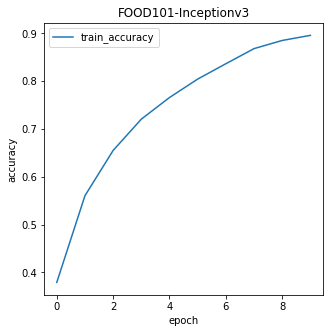
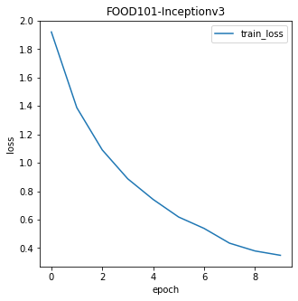
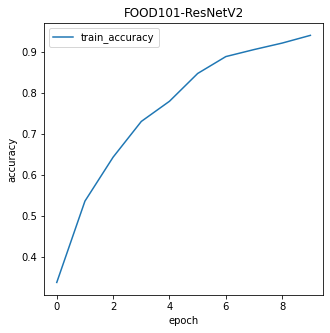
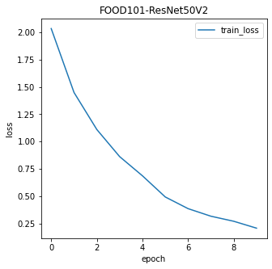
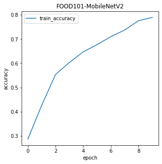
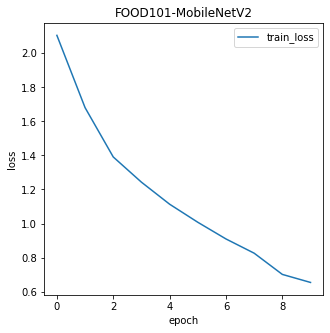

# Q1. Summary

<p>

For my CSCI 444 term project I chose to perform transfer learning on 3 different models, InceptionV3, 
ResNet50V2, and MobileNetV2. The goal of this project is to add identical layers to pretrained models, and
evaluate their performance on a new dataset. I used a 
[colab notebook](https://colab.research.google.com/github/theimgclist/examples/blob/MultiClassTF2.0/community/en/multi_class_classification/food_classifier.ipynb) as a springboard for my 
project, and to familiarize myself with the dataset before diving in.
</p>
<p>
 
I began by loading and cleaning the data. Once this was completed and I had smaller images to work 
with, I implemented the three aforementioned networks and began implementing transfer learning.
My primary cirteria for selection was the quality of the pretrained dataset. "imagenet" is a popular dataset used for 
training deep learning models, and contains a vast amount of classes, boasting 32'326 images in its fall 2011
release. This lead to me selecting the three aforementioned models for my project, as they were pretrained
on the "imagenet" dataset. After adding a few more layers to tailor the networks to my dataset, I trained 
the models on 10 different classes, and fed the fitted model's ```.history``` attribute into a graph and 
plotted the training accuracy and training loss over 10 epochs.
</p>
<p>

Once the accuracy and loss graphs were complete, I began working to analyze the AUC values of my data.
As image data does not have clearly defined "features", Derek inspired me to make and save a colourmap of
every individual pixel's AUC value. More detail on that process to follow. 
</p>
<h4>
A prediction
</h4>
<p>

Before diving into the details of this report, I think that the InceptionV3 model will perform the best on 
this new dataset as it is the deepest of the three architectures, thus being more suited to pixel-wise image
classification after being pretrained on the "imagenet" dataset.
</p>

# Q2. Description

<p>

My dataset of choice is Tensorflow's "food-101" dataset, aptly named for its 101 different classes of food.
This dataset contains non-square images ranging from 512 pixels in width to 512 pixels in length. There are
101'000 images in total, 1'000 per class. Those 1'000 images are further divided into 750 training images 
(specified by the dataset's ```train.txt``` file), and 250 testing images (specified by the ```test.txt``` 
file). The dataset takes up ~5GB of space (pretty big) and can be downloaded from the data vision 
[website](http://data.vision.ee.ethz.ch/cvl/food-101.tar.gz). When I submitted my project I removed the 
```images``` folder as the zipped folder was too large for moodle. By uncommenting and running the 
commented out data extraction code in ```main.py``` this folder can be re-obtained.  
</p>
<p>

Due to computational limitations I elected to only evaluate the AUC values for a dessert, apple pie, and an
entree, baby back ribs. By comparing the AUC Colourmap  
</p>
<p>

to randomly generated class images  
</p>
<p>

We can see that, according to my machine, the most important AUC values reside around the edges of the images. 
By inspecting the generated images we can see that the plating and surrounding condiments/garnish is very important to 
distinguishing between apple pie and baby back ribs. 
</p>
<p>

This makes sense and is intuitive as baby back ribs would typically be served sans-ice cream, and green 
beans and/or potatoes have no business being served with an exquisite dessert such as apple pie (in my opinion).
Another important factor that lays to the outer edges of the images is the plate itself. As we can deduce
from the randomly generated class images, apple pie appears to be served in a dish/baking tin as opposed to
on a plate as the baby back ribs are. This is another seemingly minute detail to humans that the machine is
taking into consideration when making its decisions.  
</p>
<p>

Addressing the white elephant in the room, allow me to weigh my input on the white center of the colourmap. 
The reason the center of apple pie and baby back rib images are of a "neutral" AUC standing is because of
the pixel by pixel similarity between the two classes. By analyzing the center of each class image it is 
difficult even for a human to decipher exactly the class of food. With less computational restraints I 
would be intrigued to see how the colourmap changes with 3, 10, or even all 101 classes. The central
whitespace would grow larger but otherwise I don't believe the colourmap would have any other drastic
changes when increasing the number of classes evaluated.  
</p>

# Q3. Detail

<p>

This section of my report will be broken down into the following four sections:
</p>
<ol>
    <li>
    Data cleaning
    </li>
    <li>
    Model selection
    </li>
    <li>
    Training and transfer learning
    </li>
    <li>
    Pretty graphs
    </li>
    <li>
    AUCs
    </li>
    <li>
    Conclusion
    </li>
</ol>

<h4>
Part 1 - Cleaning
</h4>
<p>

Initially, I resized all images to a 380x380 square. As you could image these large images take a long
time to train the network on. I made the design choice to replace every image with a resized version of
itself having new dimensions of (165, 165). This reduces the number of pixels evaluated by the models from
433'200 to 81'675 (difference of 351'525 pixels), meaning I'm at least capable of *running* the networks
on my machine without it melting before my eyes. This critical data preparation step saved me a lot of time
and headache slater down the line.
</p>

<h4>
Part 2 - Models
</h4>
<p>

As previously mentioned, the models used to analyze this dataset were InceptionV3, ResNet50V2, and MobileNetV2.
I elected to use these models for the main criteria of them being trained on the same "imagenet" dataset.
An added bonus to selecting these models is that they are all accessible from tensorflow's 
```tensorflow.keras.applications``` library, all with thorough documentation. Before we dive into training,
here is some background information about each model:
</p>
<ul>
    <li>
    InceptionV3 - CNN using label smoothing, factorized 7x7 convolutions, and an auxiliary classifier.
    </li>
    <li>
    ResNet50V2 - 50-layer CNN using skip connections, winner of ImageNet Challenge in 2015.
    </li>
    <li>
    MobileNetV2 - Performs well on mobile devices. Based on inverted resnet structure, with residual connections between bottleneck layers. Contains initial fully-convolutional layer with 32 filters, and 19 residual bottleneck layers after that.
    </li>
</ul>
<h4>
Part 3 - Training
</h4>
<p>

We will be approaching transfer learning on these models in the following way; 
</p>
<ol>
    <li>
    Load the model
    </li>
    <li>
    For all models, add the following layers:
        <ol>
            <li>
            MaxPool2D layer to reduce dimensions
            </li>
            <li>
            Flatten layer to recenter the data
            </li>
            <li>
            A 128 node Dense layer with relu activation to prepare for classification.
            </li>
            <li>
            A dropout layer to (hopefully) reduce the chance of us overfitting the new layers of the model 
            </li>
            <li>
            Dense layer with a softmax activation to output a single choice as to what the predicted class is.
            </li>
        </ol>
    </li>
    <li>
    Fit the model
    </li>
    <li>
    Save the model
    </li>
    <li>
    Return the fitted model
    </li>
</ol>
<p>

The above architecture allows us to perform transfer learning on our dataset, with all three of our 
selected models. This allows us to evaluate the models primarily on their architecture, which is the 
overarching goal of this project. By only training on 10 classes (10'000 images) we can see how the 
models perform on smaller datasets. 
</p>

<h4>
Part 4 - Pretty Graphs
</h4>
<p>

Now that our models are trained and re-weighted, we can find the training accuracy and loss of them and 
compare the results. Please see below the training accuracy and loss for the InceptionV3 model: 
</p>
<p>

 
</p>
<p>

As we can see, the InceptionV3 model, trained on 10 different classes over 10 epochs, has a training 
accuracy of approximately 90%. The loss of the model decreases from approximately 1.9% to under 0.4% which
is a clear indication that the model is learning and optimizing its new weights.
Next, we will observe the ResNet50V2's accuracy and loss:
</p>
<p>

 
</p>
<p>

Comparing ResNet50V2 to InceptionV3, we can see that whist both models follow the same trend, the ResNet 
model ResNet50V2 has an overall higher training accuracy of approximately 95%. It also has a much lower loss 
rate implying even better performance than the InceptionV3 model.
Finally, let's look at the results from the MobileNetV2 model:
</p>
<p>

 
</p>
<p>
Comparing all three models, we can see that MobileNetV2 under-performs compared to both InceptionV3 and 
ResNet50V2. MobileNetV2 has a training accuracy of under 80%, and a training loss of over 0.6%, which is
over 0.2% higher than the InceptionV3 model, which in turn is over 15% higher than the lowest training loss
of ResNet50V2, which is approximately 25%.
</p>

<h4>
Part 5 - AUCs
</h4>
<p>

As previously mentioned, Derek provided some inspiration for creating the colourmap seen in Part 2. When 
creating the I was limited to 2 classes deu to the hardware limitations of my machine. Using the following 
steps, I was able to create the previously seen colourmap.
</p>
<p>
<ol>
    <li>
    Get the AUC value of every pixel of all images in both classes and reshape to (165, 165, 3) ndarray
    </li>
    <li>
    Normalize all values from 0-255
    </li>
    <li>
    Average across channel numbers to get a 2D from the 3D one returned in Step 1
    </li>
    <li>
    Plot 2D array of pixel-wise AUC values to a colourmap and save it to a given directory
    </li>
</ol>

<h4>
Part 6 - Conclusion
</h4>

<p>
In conclusion, ResNet50V2 was the best model. I believe this is due to its recursive architecture and
skip connections, allowing for an alternate path for the gradient during backpropagation. While skip
connections can be implemented as either addition or concatenation, ResNet50V2 uses skip connections via
addition. My initial prediction of the InceptionV3 model outperforming the other two was incorrect.
</p>


